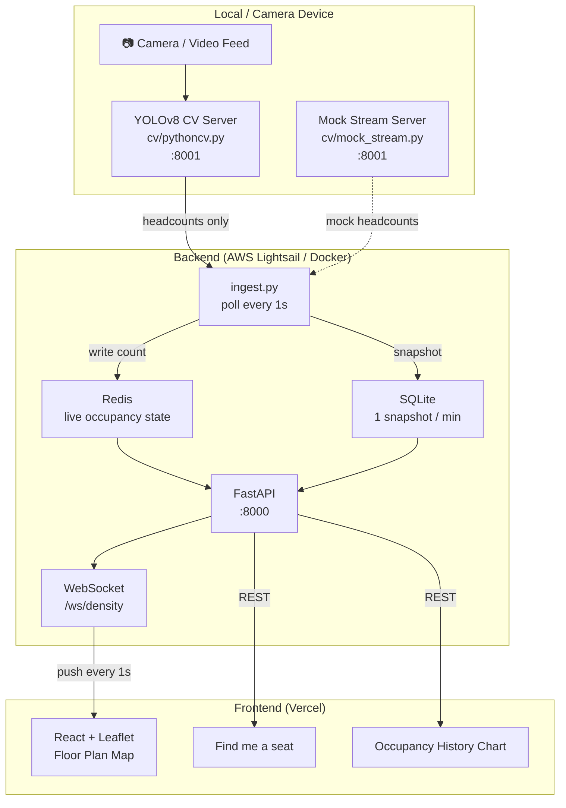

# CrowdMap

Real-time campus occupancy monitoring for Northeastern University Seattle — 225 Building, 2nd Floor.

**Live demo:** [crowdmap-nu-seattle.vercel.app](https://crowdmap-nu-seattle.vercel.app)


> **Note:** This project was originally built by our team during the Emerald Forge Hackathon 2026. This fork contains my post-hackathon engineering extensions: WebSocket re-integration, mock-stream mode, backend containerization, HTTPS/WSS via nginx + Let's Encrypt, GitHub Actions CI, and cloud deployment (Vercel + AWS Lightsail).

---

## Architecture



**Privacy-first design:** video never leaves the local device — only headcounts are transmitted.

---

## Features

- **Real-time floor plan** — color-coded zone overlays (low / medium / high) update every second via WebSocket
- **Find me a seat** — recommends the least crowded area instantly
- **Occupancy history** — sparkline chart showing the past hour per zone
- **Space density** — cross-zone comparison normalized by area size
- **Mock-stream mode** — simulates realistic time-of-day occupancy patterns (no camera required), enabling public demos
- **Privacy-first CV** — YOLOv8 detects headcounts only; no video is stored or transmitted
- **Containerized** — full stack runs with `docker compose up`

---

## Tech Stack

| Layer | Technology |
|-------|-----------|
| Computer Vision | Python, OpenCV, YOLOv8 (Ultralytics) |
| Backend | FastAPI, WebSocket, Redis, SQLite |
| Frontend | React, Leaflet (react-leaflet) |
| Infra | Docker, nginx, Let's Encrypt, GitHub Actions CI/CD |
| Deployment | Vercel (frontend), AWS Lightsail (backend) |

---

## How to Run Locally

### Option A — Docker (recommended)

```bash
docker compose up --build
```

Starts Redis, mock CV server, and backend. Then start the frontend separately:

```bash
cd frontend && npm install && npm start
```

### Option B — Manual

**Prerequisites:** Python 3.11+, Node.js, Redis

```bash
# Terminal 1 — Redis
brew services start redis

# Terminal 2 — Mock CV server (no camera needed)
cd cv && python3 -m venv venv && source venv/bin/activate
pip install fastapi uvicorn
python3 mock_stream.py

# Terminal 3 — Backend
cd backend && source venv/bin/activate
pip install -r requirements.txt
uvicorn main:app --host 0.0.0.0 --port 8000

# Terminal 4 — Frontend
cd frontend && npm install && npm start
```

Open [http://localhost:3000](http://localhost:3000).

---

## Mock-Stream Mode

`cv/mock_stream.py` is a drop-in replacement for the live CV server. It simulates realistic time-of-day occupancy patterns (morning rush, lunch peak, evening wind-down) with per-zone phase shifts and random walk noise — no camera or hardware required. Switch modes by running `mock_stream.py` instead of `pythoncv.py`; the backend requires no changes.

---

## Performance

| Metric | Value |
|--------|-------|
| Detection accuracy | ~90% (YOLOv8n) |
| End-to-end latency | < 2s |
| WebSocket push interval | 1 second |
| Historical snapshot interval | 1 minute |
| Zones monitored | 4 |

---

## Project Structure

```
crowdmap/
├── cv/
│   ├── pythoncv.py          # Live YOLOv8 CV server (port 8001)
│   ├── mock_stream.py       # Mock CV server for demos
│   ├── detector.py          # YOLOv8 inference wrapper
│   └── cameras_config.json  # Camera / video source config
├── backend/
│   ├── main.py              # FastAPI app, REST + WebSocket
│   ├── ingest.py            # Background CV poller (1s interval)
│   ├── cache.py             # Redis helpers
│   ├── db.py                # SQLite schema and queries
│   ├── test_main.py         # pytest test suite
│   └── requirements.txt
├── frontend/
│   └── src/App.js           # React + Leaflet dashboard
├── docker-compose.yml
└── .env.example
```

---

## CI/CD

GitHub Actions runs on every push and pull request to `main`:

- **Backend tests** — pytest (12 tests, no external services required)
- **Frontend build** — `npm run build`
- **Deploy** — on push to `main`, automatically SSHes into AWS Lightsail and runs `docker compose up --build -d`

---

## Future Improvements

- PostgreSQL / RDS for persistent historical data
- Multi-floor support
- People flow direction detection
